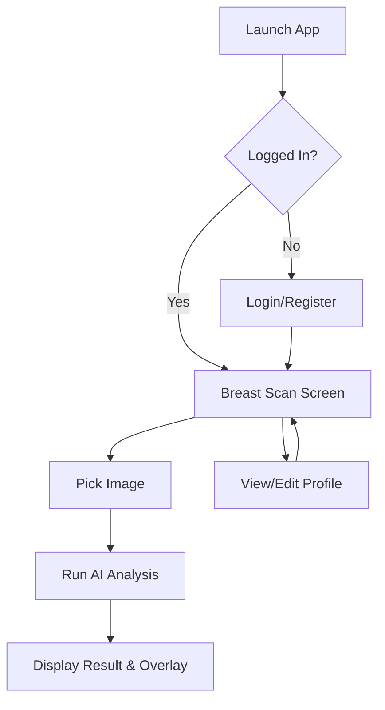

# Breast Cancer Diagnosis and Tumor Segmentation System using AI

A complete AI product (mobile application + backend) for automated classification (benign, malignant, normal) and segmentation of breast tumors from ultrasound images. The project is developed with a focus on product metrics, risk management (Safety Specs), and strict quality control (AI Spec Pack).

## Team #2
1. **Karim Gallyamov** — System Architect
2. **Mansur Zakirov** — Backend Developer (API Server)
3. **Ramil Zaripov** — Mobile Developer (Flutter App)
4. **Ilyas Kalimullin** — Data Engineer (Data Preparation)
5. **Ivan Kosach** — Scrum Master (Documentation)
6. **Hossam Mohamed Eid** — ML Engineer (Model Creation & Training, Process Organization)

---

## Repository Structure (AI Spec Pack)
The repository is organized strictly according to the AI feature lifecycle standard:

* `/specs/` — Product Documentation: PRD, Data Spec, Definition of Done (DoD).
* `/src/` — System source code (Flutter app `Breast-App-main` and `streamlit` server).
* `/tests/` — Golden image set (`test_images`) for behavioral testing.
* `/pipelines/` — Jupyter notebooks with baseline experiments (classification and segmentation).
* `/reports/` — Model Registry for `.keras` and `.tflite` artifacts.

---

## Tech Stack

- **Framework**: [Flutter](https://flutter.dev/)
- **State Management**: [BLoC / Cubit](https://pub.dev/packages/flutter_bloc)
- **Backend**: [Firebase](https://firebase.google.com/) (Auth, Firestore)
- **AI Inference**: [TensorFlow Lite (TFLite)](https://pub.dev/packages/tflite_flutter) & Streamlit (Server)
- **Dependency Injection**: [GetIt](https://pub.dev/packages/get_it)
- **Functional Programming**: [Dartz](https://pub.dev/packages/dartz) (Either for error handling)
- **UI Libraries**: `flutter_screenutil`, `awesome_snackbar_content`, `image_picker`

---

## Getting Started

### Prerequisites
- [Flutter SDK](https://docs.flutter.dev/get-started/install)
- [Python 3.9+](https://www.python.org/downloads/)
- [Firebase account](https://firebase.google.com/) and a project set up.

### Setup Instructions
1. **Clone the repository:**
   ```bash
   git clone <repository-url>
   cd flutter-streamlit-breast-ai
   ```

2. **Setup the AI Server (Streamlit):**
   ```bash
   cd src/streamlit_server # Adjust this path to the actual streamlit folder
   pip install -r requirements.txt
   streamlit run app.py
   ```

3. **Setup the Mobile App (Flutter):**
   ```bash
   cd src/Breast-App-main
   flutter pub get
   flutter run
   ```

## Architecture

The project follows a **Clean Architecture** inspired modular structure:
- **UI Layer**: Independent widgets and screens that depend on Cubits.
- **Logic Layer**: Business logic separated from UI using BLoC/Cubit.
- **Data Layer**: Repositories managing data flow from Firebase and TFLite services.
- **DI Container**: Centralized dependency management using `GetIt`.

## App Flow


