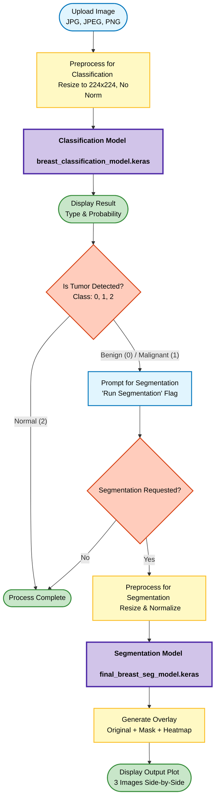
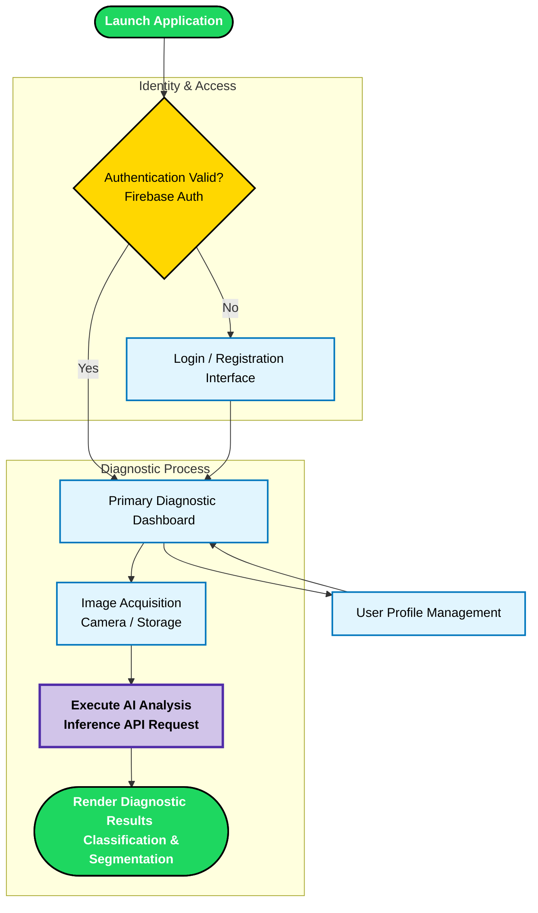

# Breast Cancer Diagnosis and Tumor Segmentation System

A comprehensive software solution (mobile application and backend inference server) for automated classification (benign, malignant, normal) and segmentation of breast tumors from ultrasound images. The project prioritizes clinical workflow simulation, product metrics, and strict quality control standards.

## 1. Project Team
1. **Karim Gallyamov** — System Architecture
2. **Mansur Zakirov** — Backend Development (API Server)
3. **Ramil Zaripov** — Mobile Development (Flutter Client)
4. **Ilyas Kalimullin** — Data Engineering (Data Preparation & Processing)
5. **Ivan Kosach** — Scrum Master (Documentation & Agile Process)
6. **Hossam Mohamed Eid** — Machine Learning Engineering (Model Architecture, Training & ML Ops)

---

## 2. Technology Stack

- **Client Framework**: [Flutter](https://flutter.dev/)
- **State Management**: [BLoC / Cubit](https://pub.dev/packages/flutter_bloc)
- **Backend & Identity**: [Firebase](https://firebase.google.com/) (Auth, Firestore)
- **AI Inference Engine**: [TensorFlow Lite (TFLite)](https://pub.dev/packages/tflite_flutter) & Streamlit (API Server)
- **Dependency Injection**: [GetIt](https://pub.dev/packages/get_it)
- **Functional Programming**: [Dartz](https://pub.dev/packages/dartz) (Error handling abstraction)
- **UI Components**: `flutter_screenutil`, `awesome_snackbar_content`, `image_picker`

---

## 3. Repository Structure

The repository follows standard software engineering practices for AI feature integration:
- `/specs/` — Product requirements and specifications (PRD, Data Spec, DoD).
- `/src/` — Application source code (Flutter mobile application and Python Streamlit server).
- `/tests/` — Behavioral test images (one sample per class: Benign, Malignant, Normal).
- `/pipelines/` — Experimental Jupyter notebooks for model training and baseline evaluation.
- `/reports/` — Model Registry containing compiled `.keras` and `.tflite` artifacts (heavy binaries are stored outside Git).
- `/Notebooks/` — Jupyter notebooks for data analysis, exploration, and model experimentation.

---

## 3.1 Model Artifacts (External Storage)

Due to GitHub size limitations, trained model weights are stored externally and **not committed** to this repository.

- **Google Drive folder with models**:  
  `https://drive.google.com/drive/folders/1b_76X1dxtyZUJ4Kuqg6MH9oTr7mSUjmA?usp=sharing`

Expected filenames:
- `breast_classification_model.keras`
- `final_breast_seg_model.keras`

To run the Streamlit server locally, download these files and place them under:

```text
src/streamlit/models/breast_classification_model.keras
src/streamlit/models/final_breast_seg_model.keras
```

---

## 4. System Architecture

The application architecture enforces separation of concerns through a modular, Clean Architecture approach:
- **Presentation Layer**: Independent UI components bounded to state controllers.
- **Domain Layer**: Business logic encapsulation using BLoC/Cubit.
- **Data Layer**: Repository pattern implementation for Firebase operations and AI inference routing.
- **Dependency Management**: Centralized service locator (GetIt) for predictable dependency resolution.

---

## 5. Execution Flow

### 5.1 Inference Pipeline (Streamlit API)



### 5.2 Mobile Application Flow (Flutter Client)



---

## 6. Quick Start (Makefile)

The project includes a `Makefile` for one-command reproducibility:

| Command | Description |
|---------|-------------|
| `make install` | Install Python dependencies for Streamlit server |
| `make train` | Execute training notebooks (classification + segmentation) |
| `make eval` | Run behavioral evaluation on test images in `/tests/` |
| `make serve` | Start the Streamlit inference server |
| `make flutter-run` | Build and run the Flutter mobile client |
| `make clean` | Remove cached / temporary files |

Run `make help` to see all available targets.

---

## 7. How to Run the Streamlit App (Server Only)

> At this stage the main **product artifact** is the Streamlit inference server. The Flutter app is still in active development.

### 7.1. Prerequisites
- [Python 3.9+](https://www.python.org/downloads/)
- `pip` installed

### 7.2. Clone the repository

1. Clone and enter the project:
   ```bash
   git clone <repository-url>
   cd flutter-streamlit-breast-ai
   ```

### 7.3. Install Python dependencies and run Streamlit

2. Go to the Streamlit folder and install dependencies from `requirements.txt`:
   ```bash
   cd src/streamlit
   pip install -r requirements.txt   # install all packages needed by main.py
   ```

3. Download model files from Google Drive and place them in `src/streamlit/models/` as described above.

4. Run the Streamlit app:
   ```bash
   streamlit run main.py
   ```

---

## 8. (Optional) Flutter Mobile Client

The Flutter client is under active development. Once ready, it will:
- Authenticate the user (Firebase).
- Capture or select ultrasound images.
- Send images to the Streamlit API.
- Render classification and segmentation results.

Flutter setup (for future use):

```bash
cd src/Breast-App-main
flutter pub get
flutter run
```