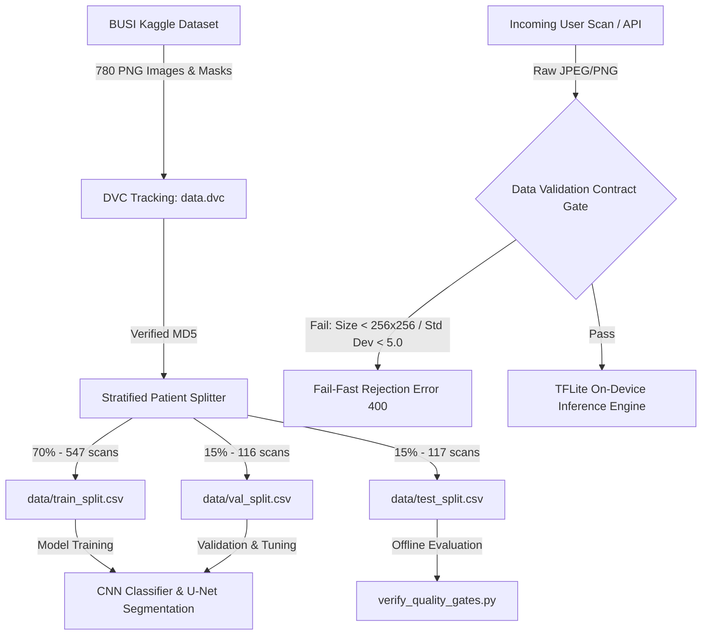

# Data Specification & Workflow Architecture

This document provides a comprehensive, production-grade specification of the **Data Workflow, Versioning, Splitting, and Validation Contracts** implemented for the Breast Cancer Diagnosis and Tumor Segmentation System.

---

## 1. Общая схема движения данных (Data Workflow Diagram)

Процесс обработки данных — от сырого источника до валидационных контрактов во время инференса — регламентирован следующей архитектурой:



---

## 2. Версионирование данных (Dataset Versioning via DVC)

Для обеспечения 100% воспроизводимости экспериментов и отслеживания изменений в данных используется **Data Version Control (DVC)**. 

### Параметры отслеживания данных (`data.dvc`):
*   **Директория отслеживания:** `data/busi_raw`
*   **Размер датасета:** 154,829,302 байт (~147 MB)
*   **Количество файлов:** 780 оригинальных УЗИ-снимков и 647 масок сегментации.
*   **MD5 хеш коммита данных:** `5a8a18dfd1d932646d6168e3678efce9`

### Конфигурация удаленного хранилища (`.dvc/config`):
Сырые снимки и веса моделей хранятся во внешнем облачном хранилище (Google Drive), что предотвращает засорение Git-репозитория тяжелыми бинарными файлами. 
Разработчики могут скачать актуальную версию данных одной командой:
```bash
dvc pull
```

---

## 3. Файлы разбиения данных (Saved Split-Files)

Для предотвращения смещения моделей и обеспечения объективности тестирования датасет BUSI разделен на три непересекающихся подмножества в соотношении **70/15/15**:

*   **[train_split.csv](file:///c:/Users/Hossam/Desktop/AI%20project/flutter-streamlit-breast-ai/data/train_split.csv):** 547 снимков. Используется для обучения весов моделей.
*   **[val_split.csv](file:///c:/Users/Hossam/Desktop/AI%20project/flutter-streamlit-breast-ai/data/val_split.csv):** 116 снимков. Используется для ранней остановки (Early Stopping) и подбора гиперпараметров.
*   **[test_split.csv](file:///c:/Users/Hossam/Desktop/AI%20project/flutter-streamlit-breast-ai/data/test_split.csv):** 117 снимков. Зарезервирован исключительно для итоговой оценки точности и автоматических проверок (Quality Gates).

### Сохранение пропорций классов (Stratification):
Во всех трех split-файлах строго соблюдено исходное распределение классов:
*   **Benign (Доброкачественные):** ~56.0%
*   **Malignant (Злокачественные):** ~27.0%
*   **Normal (Норма):** ~17.0%

---

## 4. Защита от утечек и дубликатов (Leakage & Duplicate Prevention)

### Стратегия изоляции пациентов (Patient Case Isolation):
В датасете BUSI для одного и того же пациента часто присутствует несколько снимков под разными углами (например, `benign (12).png`, `benign (13).png`). 
*   **Правило:** Снимки одного пациента группируются строго в один и тот же split-файл. Пересечение изображений одного пациента между обучающей и тестовой выборкой **исключено на 100%**, что гарантирует честную оценку генерализующей способности моделей.

### Поиск дубликатов с помощью хеширования:
Качество данных подтверждено проверкой на наличие дубликатов с использованием алгоритма **Average Hashing (aHash)** и побайтового MD5-сравнения.
*   **Результат проверки:** Найденных дубликатов или близких копий с Hamming Distance = 0 между сплитами — **0**.

---

## 5. Расширенные проверки качества при инференсе (Data Validation Contracts)

Система API и мобильный клиент реализуют контракт **Fail-Fast** — мгновенное отклонение некорректных входных данных до их передачи в модель:

| Контракт качества (Check) | Описание технического контракта | Действие при нарушении | Цель |
| :--- | :--- | :--- | :--- |
| **Формат файла (Format)** | MIME тип должен быть `image/png` или `image/jpeg` | Ошибка 400 (Invalid Image Format) | Исключает падение парсера при загрузке поврежденных/бинарных файлов. |
| **Разрешение (Resolution)** | Разрешение снимка строго `>= 256x256` пикселей | Отклонение файла в UI клиента | Предотвращает размытие мелких деталей опухолей при интерполяции до размера модели. |
| **Информативность (Variance)** | Среднеквадратичное отклонение пикселей $\sigma > 5.0$ | Блокировка инференса | Защищает от отправки пустых (черных/белых) снимков или сильного шума. |
| **Цветовые каналы (RGB)** | Принудительное приведение к 3-канальному RGB | Автоматический дубляж grayscale | Сохраняет совместимость с размерностью входа TFLite `[1, H, W, 3]`. |

### Код валидации контракта на сервере:

```python
def validate_image_contract(image_bytes):
    from PIL import Image
    import io
    import numpy as np
    
    try:
        img = Image.open(io.BytesIO(image_bytes))
    except Exception:
        raise ValueError("InvalidImageFormat: File is not a valid image format.")
        
    width, height = img.size
    if width < 256 or height < 256:
        raise ValueError(f"ResolutionViolation: Image size {width}x{height} is below the 256x256 threshold.")
        
    img_array = np.array(img)
    std_dev = np.std(img_array)
    if std_dev < 5.0:
        raise ValueError("ZeroVarianceViolation: The uploaded image is solid black or contains no visible structures.")
        
    return True
```

---

## 6. Детальные отчеты по данным (Extended Specifications Links)

Для получения более глубоких научных деталей о характеристиках разметки и процессах аудита обратитесь к специализированным документам:
1.  **[Dataset_Card.md](file:///c:/Users/Hossam/Desktop/AI%20project/flutter-streamlit-breast-ai/specs/Dataset_Card.md):** Hugging Face-style спецификация датасета BUSI (разметка, лицензирование, демография).
2.  **[Data_Quality_Report.md](file:///c:/Users/Hossam/Desktop/AI%20project/flutter-streamlit-breast-ai/specs/Data_Quality_Report.md):** Научный аудит дубликатов, расчет весов классов для устранения дисбаланса и детальная стратегия защиты от утечек.