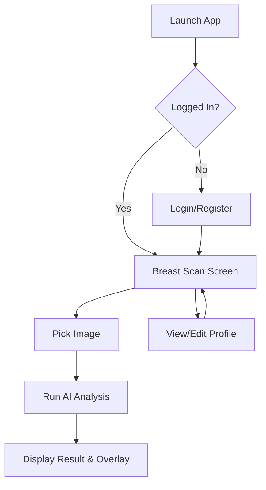

# Breast App 

A high-performance Flutter mobile application designed for **Breast Cancer Detection and Segmentation**. Leveraging cutting-edge AI technologies and a modern tech stack, this application provides users with a seamless and reliable way to analyze medical images and manage their profiles.

## ✨ Features

- **🔐 Secure Authentication**
  - Modern Login & Registration flows.
  - Robust error handling and user feedback.
  - Integrated with Firebase Auth.

- **👤 User Management**
  - Detailed Profile view and editing.
  - Data persistence with direct Firestore integration.

- **🤖 AI-Powered Analysis**
  - **Tumor Classification**: Identifies Benign vs. Malignant tumors using optimized TFLite models.
  - **Precise Segmentation**: Generates high-quality segmentation masks to highlight tumor areas.
  - **Dynamic Overlays**: Smooth visualization of masks directly over the analyzed images.

- **🎨 Premium UI/UX**
  - Responsive layout for all screen sizes using `ScreenUtil`.
  - Harmonious color palettes and modern typography.
  - Intuitive navigation and interactive components.

## 🛠️ Tech Stack

- **Framework**: [Flutter](https://flutter.dev/)
- **State Management**: [BLoC / Cubit](https://pub.dev/packages/flutter_bloc)
- **Backend**: [Firebase](https://firebase.google.com/) (Auth, Firestore)
- **AI Inference**: [TensorFlow Lite (TFLite)](https://pub.dev/packages/tflite_flutter)
- **Dependency Injection**: [GetIt](https://pub.dev/packages/get_it)
- **Functional Programming**: [Dartz](https://pub.dev/packages/dartz) (Either for error handling)
- **UI Libraries**: `flutter_screenutil`, `awesome_snackbar_content`, `image_picker`

## 📁 Project Structure

```text
lib/
├── core/             # Shared utilities, DI, navigation, and theme
│   ├── di/           # Dependency injection (GetIt)
│   ├── navigation/   # Context-less navigation service
│   ├── routes/       # Route naming and generation
│   └── theme/        # Global app theme and styles
├── features/         # Modular feature-based structure
│   ├── auth/         # Authentication & Profile management
│   │   ├── data/     # Repositories & Models (Firestore/Auth)
│   │   ├── logic/    # Cubits & States
│   │   └── ui/       # Views & Widgets (Login, Profile, etc.)
│   └── breast_scan/  # AI Scanner core functionality
│       ├── data/     # AI Services (Classification & Segmentation)
│       ├── logic/    # Scan Cubit for state management
│       └── ui/       # Scan views and custom overlays
└── main.dart         # App entry point & Bloc initialization
```

## 🚀 Getting Started

### Prerequisites
- [Flutter SDK](https://docs.flutter.dev/get-started/install)
- [Firebase account](https://firebase.google.com/) and a project set up.

### Setup Instructions

1. **Clone the repository**

2. **Install dependencies**
   ```bash
   flutter pub get
   ```

3. **Firebase Configuration**
   - Place your `google-services.json` in `android/app/`.
   - Place your `GoogleService-Info.plist` in `ios/Runner/`.
   - Or use the FlutterFire CLI: `flutterfire configure`.

4. **TFLite Models**
   - Ensure the models are located in `assets/models/`:
     - `breast_classification_model.tflite`
     - `breast_segmentation_model.tflite`

5. **Run the App**
   ```bash
   flutter run
   ```

## 🏗️ Architecture

The project follows a **Clean Architecture** inspired modular structure:
- **UI Layer**: Independent widgets and screens that depend on Cubits.
- **Logic Layer**: Business logic separated from UI using BLoC/Cubit.
- **Data Layer**: Repositories managing data flow from Firebase and TFLite services.
- **DI Container**: Centralized dependency management using `GetIt`.

## 🔄 App Flow



---
*Created with ❤️ for better health diagnostic tools.*
