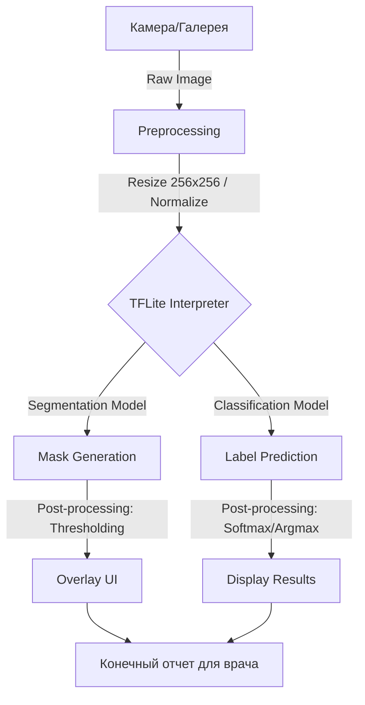
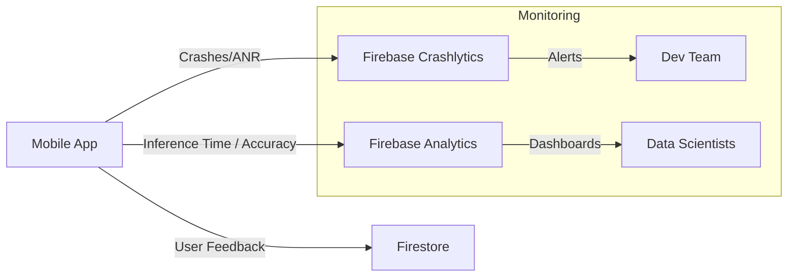

# Архитектура развертывания и инференса системы ИИ для анализа рака груди

## 1. Описание AI-системы и её контекста
**Breast Cancer AI System** — это интеллектуальная мобильная система поддержки принятия врачебных решений (СППВР), предназначенная для анализа ультразвуковых изображений молочной железы (наборе данных BUSI). 
Система решает две основные задачи:
*   **Сегментация:** Выделение границ новообразования на снимке.
*   **Классификация:** Определение типа патологии (Normal, Benign, Malignant).

**Контекст:** Приложение ориентировано на использование в медицинских учреждениях и в качестве инструмента предварительного скрининга. Ключевым требованием является конфиденциальность данных пациентов и возможность работы в условиях ограниченного интернет-соединения.

## 2. Выбор режима инференса
Для данной системы выбран **синхронный инференс на конечном устройстве (Edge/On-Device Inference)**.

**Обоснование:**
*   **Конфиденциальность:** Медицинские изображения не покидают устройство пользователя, что критически важно для соблюдения законов о защите персональных данных (аналоги 152-ФЗ/GDPR).
*   **Автономность:** Возможность проведения анализа в клиниках без стабильного интернет-покрытия.
*   **Низкая задержка (Latency):** Мгновенный отклик интерфейса без затрат времени на передачу тяжелых изображений на сервер.

## 3. Схема inference pipeline
Процесс обработки данных от камеры до отображения результата:

## 4. Выбор инструментов и обоснование
| Слой | Инструмент | Обоснование |
| :--- | :--- | :--- |
| **Framework** | Flutter | Кроссплатформенность (iOS/Android) с единой базой кода и высокой скоростью рендеринга UI. |
| **Inference Engine** | TFLite (TensorFlow Lite) | Оптимизированный движок для мобильных GPU/NPU, обеспечивающий высокую скорость при малом потреблении памяти. |
| **Logic/State** | Bloc/Cubit | Четкое разделение бизнес-логики инференса и пользовательского интерфейса. |
| **Backend/Cloud** | Firebase | Использование Firebase для удаленной конфигурации моделей и мониторинга стабильности. |

## 5. Описание API-контракта моделей
Инференс осуществляется через тензорный интерфейс TFLite:

### А. Модель сегментации
*   **Input:** Тензор `[1, 256, 256, 3]`, тип `Float32` (Нормализованные пиксели изображения).
*   **Output:** Тензор `[1, 256, 256, 1]`, тип `Float32` (Вероятностная маска опухоли).

### Б. Модель классификации
*   **Input:** Тензор `[1, 224, 224, 3]`, тип `Float32`.
*   **Output:** Тензор `[1, 3]`, тип `Float32` (Вероятности для классов: Normal, Benign, Malignant).

## 6. Список SLI/SLO
Для мобильного инференса установлены следующие целевые показатели:

*   **Latency SLO:** 
    *   Классификация: < 150 мс на устройствах среднего сегмента.
    *   Сегментация: < 400 мс (включая постобработку маски).
*   **Availability SLO:** 99.9% (приложение должно работать в офлайн-режиме, ошибки инференса только при нехватке памяти).
*   **Throughput SLI:** Количество успешно обработанных снимков в секунду (цель: обработка в реальном времени при наведении камеры).
*   **Model Accuracy SLO:** F1-score > 0.85 для классификации на валидационной выборке.

## 7. Стратегия rollout и план rollback
Развертывание новых версий моделей происходит без обновления всего приложения через **Firebase Remote Config**.

1.  **Phase 1: Canary Release.** Новая модель загружается 5% пользователей.
2.  **Phase 2: Мониторинг.** Проверка метрик Latency и Crash Rate через Crashlytics.
3.  **Phase 3: Full Rollout.** Расширение на 100% аудитории при отсутствии аномалий.

**План Rollback:** В случае обнаружения деградации метрик, в панели Firebase Remote Config параметр `model_version` переключается на предыдущее стабильное значение, и устройства автоматически скачивают старую версию модели при следующем запуске.

## 8. Схема observability и план сбора данных
Для отслеживания качества работы системы в реальных условиях используется следующая схема мониторинга:

**План сбора данных:**
*   **Логирование:** Сбор времени выполнения `interpreter.run()` для мониторинга производительности на разных моделях процессоров.
*   **Feedback Loop:** Возможность для врача подтвердить или скорректировать результат ИИ. Эти данные анонимизируются и используются для дообучения (Retraining) моделей в следующем цикле разработки.
