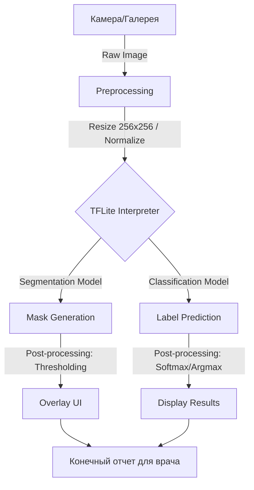
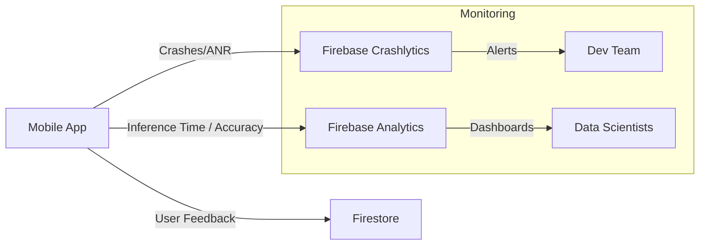

# Архитектура развертывания и инференса системы ИИ для анализа рака груди

**Команда:** Karim, Mansur, Ramil, Ilyas, Ivan, Hossam.  

## 1. Описание AI-системы и её контекста
**Breast Cancer AI System** — это гибридная двухкомпонентная система поддержки принятия врачебных решений (СППВР), разработанная для высокоточного анализа ультразвуковых снимков молочной железы (набор данных BUSI). 

Система реализует **гибридную архитектуру двойного развертывания (Dual-Deployment Hybrid Architecture)**, включающую:
1. **Первичный целевой продукт (Primary Target):** Мобильное приложение Flutter с **локальным Edge-инференсом (TFLite)** непосредственно на устройстве врача. Обеспечивает абсолютную конфиденциальность (снимки не покидают телефон), мгновенный отклик и работу без интернета.
2. **Вторичный целевой продукт (Secondary Target):** Веб-сервер **Streamlit** с API-интерфейсом на базе Keras. Выступает в роли демонстрационного портала, интерактивной песочницы для разработки, хаба телеметрии и резервного API для удаленного аудита.

## 2. Выбор режима инференса
Для обеспечения максимальной гибкости и соответствия строгим медицинским требованиям система развернута в двух режимах:

*   **Локальный Edge-инференс (Flutter + TFLite) — Основной продакшн:**
    *   *Конфиденциальность:* Медицинские снимки обрабатываются локально. Данные пациентов полностью защищены (соответствие требованиям GDPR/152-ФЗ).
    *   *Автономность:* Возможность проведения скрининга в отдаленных клиниках без стабильного интернет-соединения.
    *   *Минимальный Latency:* Время обработки снимков составляет <150 мс для классификации и <400 мс для сегментации.
*   **Серверный Cloud-инференс (Streamlit + Keras) — Демонстрация и бекап API:**
    *   *Интерактивность:* Высококачественный веб-интерфейс для внешних консультаций и демонстраций.
    *   *Сбор телеметрии:* Выступает точкой интеграции для сбора обратной связи врачей (Human Feedback Loop) и логирования событий низкой уверенности (Low-Confidence Events) для последующего дообучения.

## 3. Схема inference pipeline
Процесс обработки данных от камеры до отображения результата:

## 4. Выбор инструментов и обоснование
| Слой | Инструмент | Обоснование |
| :--- | :--- | :--- |
| **Framework (Client)** | Flutter | Кроссплатформенность (iOS/Android), единая кодовая база и высокая скорость рендеринга нативного UI. |
| **Inference Engine (Client)** | TFLite (TensorFlow Lite) | Высокопроизводительный движок для мобильных GPU/NPU, обеспечивающий выполнение жестких требований Latency SLO. |
| **Logic/State** | Bloc/Cubit | Строгое разделение бизнес-логики локального инференса от UI-слоя. |
| **Backend & Web Sandbox** | Streamlit + Keras | Веб-интерфейс для интерактивного тестирования, резервного API и сбора клинической обратной связи. |
| **Backend/Cloud** | Firebase | Использование Firebase (Auth, Firestore) для авторизации, удаленного управления моделями и сбора метрик. |

## 5. Описание API-контракта моделей
Инференс осуществляется через тензорный интерфейс TFLite:

### А. Модель сегментации
*   **Input:** Тензор `[1, 256, 256, 3]`, тип `Float32` (Нормализованные пиксели изображения).
*   **Output:** Тензор `[1, 256, 256, 1]`, тип `Float32` (Вероятностная маска опухоли).

### Б. Модель классификации
*   **Input:** Тензор `[1, 224, 224, 3]`, тип `Float32`.
*   **Output:** Тензор `[1, 3]`, тип `Float32` (Вероятности для классов: Normal, Benign, Malignant).

## 6. Список SLI/SLO
Для мобильного инференса установлены следующие целевые показатели:

*   **Latency SLO:** 
    *   Классификация: < 150 мс на устройствах среднего сегмента.
    *   Сегментация: < 400 мс (включая постобработку маски).
*   **Availability SLO:** 99.9% (приложение должно работать в офлайн-режиме, ошибки инференса только при нехватке памяти).
*   **Throughput SLI:** Количество успешно обработанных снимков в секунду (цель: обработка в реальном времени при наведении камеры).
*   **Model Accuracy SLO:** F1-score > 0.85 для классификации на валидационной выборке.

## 7. Стратегия rollout и план rollback
Развертывание новых версий моделей происходит без обновления всего приложения через **Firebase Remote Config**.

1.  **Phase 1: Canary Release.** Новая модель загружается 5% пользователей.
2.  **Phase 2: Мониторинг.** Проверка метрик Latency и Crash Rate через Crashlytics.
3.  **Phase 3: Full Rollout.** Расширение на 100% аудитории при отсутствии аномалий.

**План Rollback:** В случае обнаружения деградации метрик, в панели Firebase Remote Config параметр `model_version` переключается на предыдущее стабильное значение, и устройства автоматически скачивают старую версию модели при следующем запуске.

## 8. Схема observability и план сбора данных
Для отслеживания качества работы системы в реальных условиях используется следующая схема мониторинга:

**План сбора данных:**
*   **Логирование:** Сбор времени выполнения `interpreter.run()` для мониторинга производительности на разных моделях процессоров.
*   **Feedback Loop:** Возможность для врача подтвердить или скорректировать результат ИИ. Эти данные анонимизируются и используются для дообучения (Retraining) моделей в следующем цикле разработки.
