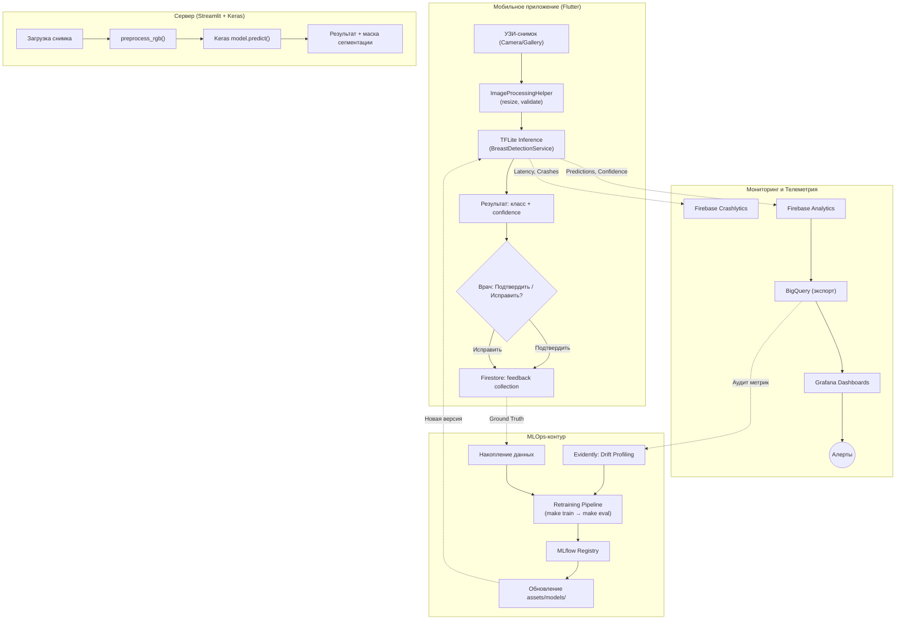

# ДЗ Лекция 7 — Monitoring, Drift и Retraining

**Проект:** Мобильное приложение (Flutter) + сервер Streamlit для диагностики рака груди и сегментации опухолей на УЗИ-снимках.  
**Команда:** Karim, Mansur, Ramil, Ilyas, Ivan, Hossam.  
**Стек:** Flutter + TFLite (on-device inference), Streamlit + Keras (серверный инференс), Firebase (Auth, Crashlytics), BLoC/Cubit.

---

## 1. Сервисный мониторинг

У нас два канала инференса: мобильное приложение (TFLite) и Streamlit-сервер (Keras). Метрики собираются по-разному для каждого.

| Метрика | Мобильное приложение (Flutter) | Streamlit-сервер | Цель |
|---------|-------------------------------|------------------|------|
| **Availability** | Crash-free sessions через Firebase Crashlytics | Uptime процесса Streamlit (systemd/Docker healthcheck) | ≥ 99% |
| **P95 Latency** | Время `_interpreter!.run()` в `BreastDetectionService` и `BreastSegmentationService` | Время `model.predict()` в `main.py` | < 200 мс (классификация), < 500 мс (сегментация) |
| **Error Rate** | Доля `BreastScanStatus.failure` в Cubit (ошибки загрузки TFLite, OOM, битое изображение) | HTTP 500, исключения при `load_model()` | < 1% |
| **Throughput** | Количество вызовов `scanImage()` + `runSegmentation()` в день | Количество POST-запросов к Streamlit в день | Информативная |

**Где смотреть:** Firebase Console (Crashlytics, Performance), логи Streamlit (stdout/stderr).

---

## 2. Мониторинг входных данных

Наш код уже делает часть проверок «на лету»:

* **Пропуски и пустые значения:** В `BreastDetectionService.predict()` проверяется `if (resizedImage == null) throw Exception("Could not decode image")`. Это Fail-Fast на null и битые файлы.
* **Некорректные входы:** В `BreastSegmentationService.predict()` есть проверка размерности output — если вместо сегментационной модели случайно загрузили классификационную, выбрасывается внятная ошибка с описанием. В `Data_Spec.md` описан контракт: только `image/jpeg` и `image/png`, минимум 256×256.
* **Изменение структуры:** Модели ожидают фиксированный input shape: `224×224` для классификации, `256×256` для сегментации. При несоответствии `ImageProcessingHelper.decodeAndResize()` ресайзит автоматически — но резкое изменение исходных разрешений (например, переход клиники на другой аппарат) нужно отслеживать.
* **Изменение распределений:** Если средняя яркость и контрастность загружаемых снимков вдруг резко изменились — это сигнал, что данные идут с другого оборудования. Пока мы это не логируем автоматически, но в плане добавить сбор `mean_brightness` и `std_contrast` на уровне `ImageProcessingHelper`.
* **Признаки data drift:** Например, если клиника перешла с одного УЗ-аппарата на другой, текстура снимков может измениться. Это можно обнаружить через периодический запуск Evidently-профилей по накопленным данным.

---

## 3. Мониторинг предсказаний модели

* **Контроль confidence:** В `BreastDetectionService.predict()` возвращается `maxScore` — максимальная вероятность softmax. Это и есть confidence. Мы его уже передаём на UI (`probability` в `BreastScanState`).
* **Доля low-confidence:** Нужно логировать случаи, где `maxScore < 0.7`. Сейчас мы это показываем пользователю, но не агрегируем. В плане — отправлять Firebase Analytics event `low_confidence_prediction`.
* **Доля fallback:** В `DoD.md` прописано, что система должна говорить «Не уверен» при низком confidence. Нужно считать долю таких случаев от общего числа сканирований.
* **Распределение классов:** Три класса — `Benign (0)`, `Malignant (1)`, `Normal (2)`. Если вдруг 90% предсказаний стали `Normal` — что-то не так. Нужно логировать `predictedClass` в Firebase Analytics.
* **Аномальное поведение:** Резкое падение среднего confidence или перекос в один класс — сигнал, что модель деградировала. Это можно ловить по агрегированным данным из Firebase/BigQuery.

---

## 4. Мониторинг бизнес-поведения

Наш продукт — это «второе мнение» для врача (Copilot). Бизнес-метрики завязаны на клиническую ценность:

* **Ручные исправления:** Если врач получил результат `Benign`, но по факту поставил `Malignant` — это ценнейшие данные. Пока в приложении нет кнопки «Исправить», но мы планируем добавить механизм фидбэка.
* **Спорные кейсы:** Врач может пометить снимок как «требующий консилиума». Это будет отдельная кнопка в UI.
* **Отказ от результата:** Когда врач закрывает экран результатов и не использует предсказание — это «rejection». Можно отслеживать через Firebase Analytics (event `result_dismissed`).
* **Влияние на процесс:** В PRD прописана метрика: сокращение времени на описание одного УЗИ-снимка на **30%**. Это основной KPI продукта.

---

## 5. Инструменты observability (Стек)

| Задача | Инструмент | Почему именно он |
|--------|------------|-----------------|
| Сбор метрик с мобилки | Firebase Analytics + Crashlytics | Уже интегрирован в проект (см. `firebase_options.dart`, `pubspec.yaml`) |
| Сбор метрик с сервера | Логи Streamlit + Prometheus (план) | Streamlit пока пишет в stdout, в перспективе — экспорт в Prometheus |
| Дашборды | Grafana | Подключается к BigQuery (Firebase экспорт) или к Prometheus |
| Drift / Data Profiling | Evidently | Открытый инструмент для анализа дрейфа данных, запускается offline |
| Model Registry | MLflow | Хранение версий `.keras` и `.tflite` с метриками обучения |
| Retraining pipeline | GitHub Actions + Makefile | В `Makefile` уже есть targets `make train` и `make eval` — остаётся обернуть в CI |

---

## 6. Дашборды

Планируемые представления в Grafana:

1. **Service Dashboard:** Latency TFLite на устройстве, Crash rate (Crashlytics), Streamlit uptime.
2. **Data Dashboard:** Распределение разрешений загружаемых фото, средняя яркость, количество отброшенных входов.
3. **Model Dashboard:** Распределение предсказаний по 3 классам (Benign/Malignant/Normal), средний confidence, доля low-confidence.
4. **Quality & Drift Dashboard:** Результаты Evidently-профилей, K-S тест на сдвиг распределений, алерты.

---

## 7. Алерты (Правила реакции)

| Сигнал | Порог | Действие | Ответственный |
|--------|-------|----------|---------------|
| Рост p95 latency | > 500 мс на устройстве | Проверить размер модели TFLite, профилировать inference | Ramil (Flutter) |
| Рост error rate | > 2% | Проверить логи Crashlytics, при необходимости откат через Kill Switch (описан в DoD) | Hossam (ML) |
| Drift-сигналы | K-S тест p < 0.05 на входных данных | Запуск внепланового аудита, проверка на смену оборудования в клинике | Hossam (ML) |
| Рост fallback | > 15% (порог из PRD) | Анализ low-confidence кейсов, возможный retraining | Hossam (ML) |
| Рост low-confidence | > +10% за неделю | Проверить данные и модель, возможно drift | Hossam (ML) |
| Сбой pipeline | Ошибка `make train` или `make eval` в CI | Перезапуск, анализ логов | Hossam (ML) + Ivan (Scrum) |

---

## 8. Human feedback loop

* **Подтверждение результата:** Врач видит результат (класс + probability) и может нажать «Подтвердить» — данные уходят в Firestore как ground truth.
* **Исправление результата:** Врач может изменить класс (например, `Benign → Malignant`) или перерисовать маску сегментации (в перспективе). Исправление сохраняется с привязкой к исходному предсказанию.
* **Сохранение исправлений:** Все правки хранятся в Firebase Firestore (коллекция `feedback`), анонимизированные — без данных пациента (PII), как описано в PRD.
* **Накопление hard cases:** Автоматически выделяем случаи, где confidence < 0.7 И врач исправил результат. Это кандидаты для переобучения.

---

## 9. Versioning / Registry

| Вопрос | Ответ |
|--------|-------|
| Какая модель сейчас основная? | `breast_classification_model.keras` + `.tflite` и `final_breast_seg_model.keras` + `.tflite` — хранятся в Google Drive и `/assets/models/` |
| Какая модель является кандидатом? | Пока нет challenger-версии, но при retraining новая модель сначала получает статус `Staging` в MLflow |
| На каких данных обучена? | BUSI Dataset (780 снимков, 3 класса), ноутбуки в `/pipelines/` |
| Где метрики? | В ноутбуках (classification report, IoU) + в MLflow при регистрации |
| Чем новая версия отличается? | Сравнение Recall@malignant (порог ≥ 0.95 из DoD) и IoU сегментации на тестовых снимках из `/tests/` |

---

## 10. Retraining policy

1. **Когда запускать audit:** Каждые 2 недели ИЛИ при срабатывании алерта на drift/low-confidence.
2. **Когда запускать retraining:** Накоплено 100+ правок от врачей ИЛИ Recall@malignant упал ниже 0.95 на новых данных.
3. **Когда retraining НЕ нужен:** Если проблема в коде (баг Flutter, упавший Streamlit) — это не про модель. Если drift обнаружен, но на тестовых данных из `/tests/` качество не упало — значит, модель пока справляется.
4. **Кто принимает решение:** Hossam (ML Engineer) — анализирует метрики и принимает решение. Ivan (Scrum Master) — координирует релиз.
5. **Как сравнивается новая модель:** Прогон `make eval` на тех же 3 тестовых снимках (Benign.png, Malignant.png, Normal.png) + сравнение на расширенном валидационном сете.
6. **Как попадает в rollout:** Новые `.tflite` файлы заменяются в `assets/models/`, пересобирается APK. Для Streamlit — обновление `.keras` файлов в `src/backend/models/`. Kill Switch в приложении позволяет откатить.

---

## 11. Архитектурная схема контура наблюдаемости

---

## Самопроверка перед сдачей

1. **Разница между service и model monitoring?**  
   — Service: «приложение работает, не падает, отвечает быстро» (latency, crashes). Model: «модель адекватно предсказывает» (confidence, распределение классов, drift).

2. **Какой инструмент зачем нужен?**  
   — Firebase — телеметрия с устройства. Grafana — визуализация. Evidently — профилирование данных на drift. MLflow — реестр моделей. Makefile + GitHub Actions — пайплайн обучения и оценки.

3. **Какие сигналы говорят о drift?**  
   — Смена УЗ-аппарата в клинике (другая текстура снимков), изменение средней яркости/контрастности, статистически значимый сдвиг по K-S тесту.

4. **Когда retraining нужен, а когда нет?**  
   — Нужен: Recall@malignant < 0.95, накопились правки врачей, подтверждён drift с падением качества.  
   — Не нужен: баг в UI, drift без падения метрик, слишком мало новых данных.

5. **Что сейчас в проде и как наблюдается?**  
   — В проде: `breast_classification_model.tflite` + `breast_segmentation_model.tflite` в Flutter и `.keras`-версии на Streamlit. Наблюдается через Firebase Crashlytics (crashes), Firebase Analytics (predictions), планируется Grafana.
